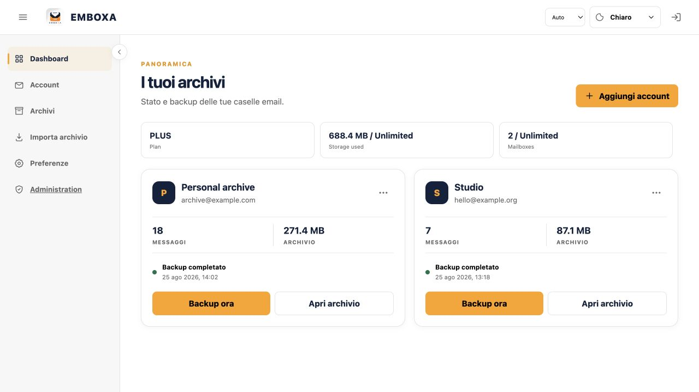
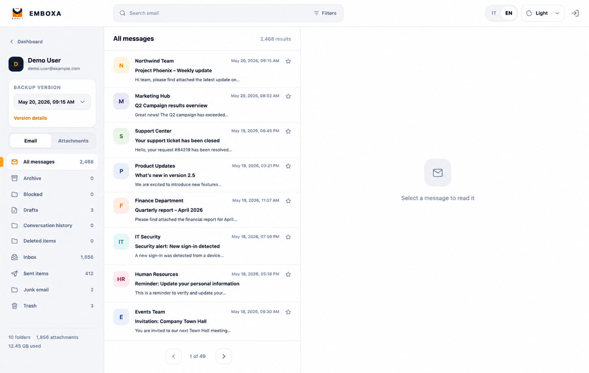
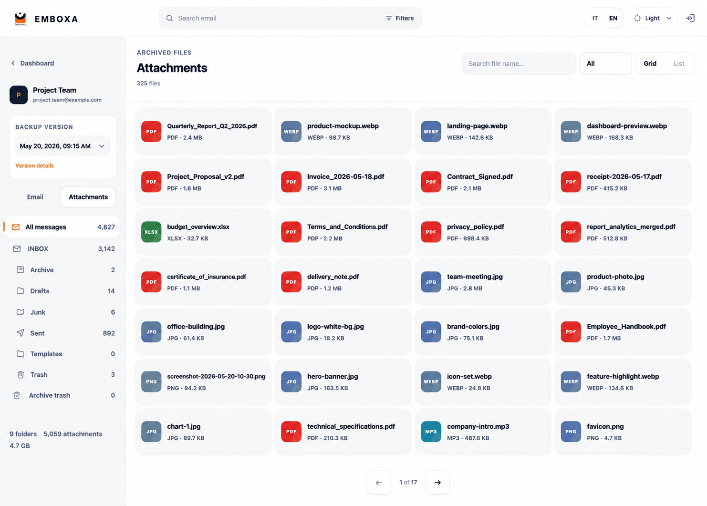

<p align="center">
  
</p>

<h1 align="center">EMBOXA Self-Hosted</h1>

<p align="center"><strong>Your email. Backed up, searchable and movable with IMAP Transfer.</strong></p>

<p align="center">
  A modern, self-hosted email backup, archive and IMAP Transfer app for Docker and TrueNAS.<br>
  Preserve complete IMAP mailboxes, attachments and backup versions, then restore originals to Gmail, Outlook, Yahoo, iCloud or custom IMAP destinations.
</p>

<p align="center">
  <a href="https://github.com/Mission-F/Emboxa/actions/workflows/container.yml"></a>
  <a href="https://github.com/Mission-F/Emboxa/pkgs/container/emboxa-web"></a>
  
  
</p>

<p align="center">
  <a href="#quick-start"><strong>Install self-hosted</strong></a>
  ·
  <a href="https://emboxa.eu">Online version</a>
</p>



## What it does

- Backs up complete mailboxes over IMAP without replacing the original provider.
- Preserves folders, message source, HTML and attachments.
- Keeps separate backup versions and protects important snapshots.
- Provides a fast, webmail-style archive with search, filters and conversations.
- Collects archived files in a dedicated Attachments view.
- Imports and exports portable `.mailvault` archives; PLUS users can also import Apple Mail/Thunderbird-style `.mbox` exports as offline accounts without synchronization.
- Uses IMAP Transfer to restore original RFC822 messages to Gmail, Outlook, Yahoo, iCloud or custom IMAP destinations, with folder preservation, duplicate checks, progress and cancellation.
- Runs as a multi-architecture container on Docker-compatible servers and TrueNAS Community.

Free Standard accounts include **5 GB of storage and up to 2 mailboxes per user**. Administrators can change limits from the runtime settings panel; PLUS users are unlimited.

## Quick Start

### TrueNAS Community

1. Open **Apps → Discover Apps → Install via YAML**.
2. Copy [`deploy/truenas-community.yaml`](deploy/truenas-community.yaml).
3. Replace these values before installing:
   - `/mnt/REPLACE_WITH_POOL/app_locali/Emboxa-Web/data` with your dataset path;
   - `NAS_IP` with the NAS address;
   - `admin@example.com` and `REPLACE_WITH_A_LONG_PASSWORD` with the first administrator credentials.
4. Install, then open `http://NAS_IP:49273`.
5. After the first successful login, remove `ADMIN_PASSWORD` from the YAML and redeploy. The administrator already stored in the database remains available.

The supplied YAML runs the container as `0:0` so a newly mounted TrueNAS host-path dataset is writable on first start. This also prevents the common `/data/secrets: Operation not permitted` restart loop. Keep the dataset dedicated to EMBOXA and restrict access through its TrueNAS ACL.

### Docker Compose

```bash
git clone https://github.com/Mission-F/Emboxa.git
cd Emboxa
cp .env.example .env
```

Edit `.env` and set, at minimum:

```dotenv
PUBLIC_APP_URL=http://YOUR_SERVER_IP:49273
PUBLIC_SITE_URL=https://emboxa.eu
COOKIE_SECURE=false
ADMIN_EMAIL=admin@example.com
ADMIN_PASSWORD=replace-with-a-long-unique-password
```

Then start the published GHCR image:

```bash
docker compose pull
docker compose up -d
```

Open `http://YOUR_SERVER_IP:49273`. After the first login, clear `ADMIN_PASSWORD` in `.env` and run `docker compose up -d --force-recreate`.

For a public HTTPS reverse proxy, use the final `https://` URL and set `COOKIE_SECURE=true`. Port `49273` may remain private to your LAN or tunnel.

## How it works

```text
IMAP mailbox → queued backup → versioned local archive → search / read / export / IMAP Transfer
```

EMBOXA first writes a staging snapshot. Only a completed, validated backup becomes the active version, so an interrupted run does not replace the previous usable archive. Saved service and IMAP credentials are encrypted using the key under `/data/secrets`.

## Screenshots

| Archive | Attachments |
| --- | --- |
|  |  |

The screenshots use synthetic example mailboxes and files.

## Configuration

| Variable | Default | Purpose |
| --- | --- | --- |
| `WEB_PORT` | `49273` | Host port exposed by Compose |
| `PUBLIC_APP_URL` | `https://app.emboxa.eu` | Canonical Web App URL used for auth, passkeys, OAuth callbacks and notifications |
| `PUBLIC_SITE_URL` | `https://emboxa.eu` | Public marketing/legal site URL |
| `COOKIE_SECURE` | `false` | Set to `true` when the public URL is HTTPS |
| `ADMIN_EMAIL` | empty | Creates the first verified administrator |
| `ADMIN_PASSWORD` | empty | Bootstrap only; remove after first login |
| `TZ` | `Europe/Rome` | Scheduler and display timezone |
| `DATA_DIR` | `/data` | Persistent database, archives, exports and keys |

Runtime settings such as schedules, retention, SMTP and Telegram are managed from the application. Never commit `.env`, credentials, databases, archive files or the contents of `/data`.

The Administration panel also controls branded transactional-email options, public SEO defaults and the Standard-plan mailbox-restore limit. Standard defaults to two queued restores per UTC calendar month; connection tests do not consume quota and Plus is unlimited.

## Updating

```bash
docker compose pull
docker compose up -d
docker image prune -f
```

The database migrations run automatically and are designed to be idempotent. Back up the data volume before a major update.

## Backup and restore

The Compose volume has the stable name `emboxa_web_data`. Stop EMBOXA and archive the entire volume so the database, messages and encryption keys stay consistent:

```bash
docker compose stop
docker run --rm -v emboxa_web_data:/data -v "$PWD":/backup alpine \
  tar czf /backup/emboxa-data.tgz -C /data .
docker compose start
```

Restore into an empty volume before starting the application:

```bash
docker compose down
docker volume create emboxa_web_data
docker run --rm -v emboxa_web_data:/data -v "$PWD":/backup alpine \
  tar xzf /backup/emboxa-data.tgz -C /data
docker compose up -d
```

For TrueNAS, snapshot or copy the complete host dataset while the app is stopped. Losing `/data/secrets/fernet.key` makes saved encrypted credentials unrecoverable.

## Import and export

Use **Import archive** in the sidebar to validate and load a `.mailvault` package. PLUS users can use **MBOX** to select an exported MBOX folder, including Apple Mail folders such as `Posta in arrivo.mbox/mbox`; EMBOXA creates an offline account that can be browsed, searched and exported, but does not try to synchronize with a provider.

Open the `…` menu on a mailbox and choose **Export archive** to create a portable copy. EMBOXA first prepares a fast, stream-friendly `.mailvault` package in the server-side exports folder, then starts the direct browser download without loading the entire archive into memory.

Admins can set **Export TTL (hours)** to `0` to keep generated export packages indefinitely. Standard users still count active exports against their storage quota. PLUS users ignore export size, storage and duration limits, so their exports are kept until manually removed or the user is deleted.

## Restore to mailbox (IMAP Transfer)

Open **Transfers → Restore to mailbox** from the sidebar or a mailbox card. The guided flow lets you choose a completed backup version, a saved destination or a new Gmail, Outlook, Yahoo, iCloud or custom IMAP mailbox, and the folder layout. EMBOXA validates the destination before queueing, appends the original RFC822 bytes, preserves source folders by default and can skip messages whose `Message-ID` already exists. Temporary passwords are encrypted only for the queued job and erased at completion, failure or cancellation.

For Google Search Console, submit `https://emboxa.eu/sitemap.xml` after the public-domain setting points to the production HTTPS hostname.

## Troubleshooting

- **Container keeps restarting:** run `docker compose logs --tail=200`. On TrueNAS, confirm you used the supplied YAML and that the dedicated dataset is mounted at `/data`.
- **`/data/secrets: Operation not permitted`:** use the current YAML, whose container user can initialize the host path, then reinstall/redeploy.
- **Login is missing after first start:** both `ADMIN_EMAIL` and `ADMIN_PASSWORD` must be present together during the first successful container start.
- **IMAP connection fails:** enable IMAP at the provider and use an app password when required. Verify host, port and TLS mode before starting a backup.
- **Public login loops:** confirm `PUBLIC_APP_URL` matches the browser URL and enable `COOKIE_SECURE` only behind working HTTPS.
- **Health check:** `curl http://YOUR_SERVER_IP:49273/api/health` should return a successful response.

## License

Copyright © MissionF. The current repository is source-available under the status described in [`LICENSE.md`](LICENSE.md); a public open-source license has not yet been selected.

---

Prefer not to self-host? Use [EMBOXA Web](https://emboxa.eu).
